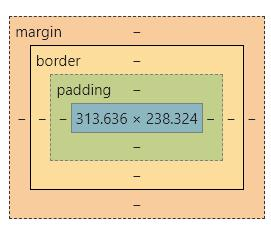

## 知识回顾
HTML升级H5，CSS升级CSS3，再次升级Bootstrap，主流一套页面UI（user interface)样式  
JavaScript 实现动态网站，js目标是可以利用代码动态操作页面上内容，实现用户和页面交互  
由静态网站技术升级动态网站  

语言强弱：  
HTML最弱、JavaScript脚本其次、Java最强  
HTML天生做网页（专向，展示）  
JavaScript天生做网页（专向，交互）操作页面元素（找到页面元素，定位，操作-获取/设置）  
Java全能，不能替代HTML，不能替代JavaScript  

JavaScript怎么管理页面呢？  
js实现一套规范：DOM（把页面的html代码变成一个DOM树）、BOM（window,history)  
不是html代码，为何要组成一颗树结构？  
查询：按顺序查找是可以，但耗费时间比较久。  
组织成树形结构后，平均遍历时间远远小于顺序。运行速度快。  

DOM常见操作，提供4种方式  
1）getElementsByTagName 标签，数组  
2）getElementsByName name属性  
3）*getElementsByClassName class属性  
4）*getElementById id属性，唯一值  
数组问题，如果页面调整顺序，获取时改代码  

jQuery 第三方，和js有什么区别？  
1）javascript原生，所有浏览器直接支持  
2）jQuery第三方，浏览器不直接支持，script导入（引入）  
3）js升级版，极大简化js开发  
	js			document.getElementsByClassName("username") 文本框  
				document.getElementsByClassName("username")[0].value  
				document.getElementsByClassName("username")[0].value = "王强"  
				
	jQuery	$(".username")  
				$(".username").val()  
				$(".username").val("王强")  
	Vue 重点，不出现上面的api，  

JavaScript有两个重要衍生品：  
1）JSON，数据传输  
2）AJAX，请求方式，请求后台系统，处理数据，返回信息JSON，拿到返回值，进行解析，最终在页面上来展现  

### jQuery简化js开发，无需去记忆晦涩难懂api
模拟用户登录案例    
1）html页面（用户名框，密码框，按钮）  
2）bootstrap 美化页面  
3）javascript交互（获取用户名和密码，把用户名在页面展示：某某用户登录成功）    
登录按钮，执行事件，单击事件onclick="js函数调用"  
function doSubmit(){ ... 获取用户名框值，获取密码框值，在页面上展现 }  
在页面添加div，把内容展示到这个div中。  
div默认不展现，执行doSubmit之后，填写完内容，再展现div  
展现：display: block  
隐藏：display: none  

取消按钮，  
获取到页面input框，给它value值设置空：空串：username.value = '';  


### 样式，盒子模型


margin在border之外留白，四个方向  
border边线，占空间，四个方向  
修饰的内容，在border的里面，在padding的外面  
padding在border内部留白，四个方向  

  
  
### 4）升级到jQuery  
1）引入（导入）第三方jQuery script src  
res仓库js  
版本，兼容性  
```<script src="js/jquery.min.js"></script>```

2）按jQuery语法去改造javascript代码（替代  ）  
语法两个部分：选择器.函数  
选择器作用，以各种手段（远远多余js提供方法）  
执行方法：函数就是要执行内容，固定语法value，val()，innerText，text(),  
innerHTML，html() 额外记忆  
Vue 利用原生，无需额外记忆api  

$("#username").val('');  
$("#password").val("");  
$替代document  
选择器，负责定位  
函数，负责执行  

### 案例：支付按钮
风险，按钮点击多次  
简单办法：禁止按钮，把按钮字修改  
 disabled="disabled"  

### 小结jQuery几个方法的差异
.text()	设置当前对象文字	div.innerText  
.css()	设置当前对象样式 	div.style  
.prop(true/false)	设置当前对象属性	button.disabled = disabled  
它们应用在不同的应用场景下  

### json
数据交换作用，纯文本结构  
json是javascript子集  
本质就是传递数据  
最早软件系统传递数据java对象  
两个系统互相访问（人力系统vb，财务系统java），找一个中间介质  
两个语言都支持介质 txt 无法标识数据分割  
xml，标记语言和html很像，html规定标签div/br，xml标签自定义  
```
<xml>
	<user1>
		<name>王强</name>
		<age>18</age>
	</user1>
	<user2>
		<name>李四</name>
		<age>28</age>
	</user2>
</xml>
```
造成网络传输时，不仅有数据，还有这些标签信息，  
JSON格式：  
```
[
	{
		name:"王强", 
		age:18
	},
	{name:"李四", age:28}
]
```
JSON格式传输量比xml方式小很多，比txt不能表达记录关系  

JSON格式要求：  
1）[]代表数组  
2）{}代表一条记录，代表一个java对象    
3）大括号里面：多个键值对，之间逗号隔开    

京东某个商品的价格的JSON字符串：    
爬虫（京东商品页面价格是直接拿不到的，后期进行页面添加）ajax二次请求写入    
链接是通过分析京东页面获取的，京东商城支持爬虫，它专门说明书，这个地址    

https://p.3.cn/prices/mgets?skuIds=J_100010378153  

访问这个网站返回内容JSON字符串：  
```
[			数组
	{		一条记录
		"p":"17999.00",						价格
		"op":"17999.00",
		"cbf":"0",
		"id":"J_100010378153",			编号
		"m":"100000.00"
	}
]
```

JSON操作api  
1）把json字符串转换js对象，解析字符串parse()  
2）把js对象转换成json字符串，封装字符串 stringify()  

json字符串：  
[{"p":"17900.00","id":"a123"}]  

JSON做为公用转换方式，浏览器直接支持：JSON.parse()；  

步骤：  
1）在谷歌浏览器（火狐）创建js的字符串 var jsonstr= ...  
2）var jsonObj = JSON.parse(jsonstr)  
3）jsonObj回车  

Uncaught SyntaxError: Unexpected token : in JSON at position 21  
错误原因：Json字符串格式写错  

请求京东网站，京东后台java加工处理数据，最后返回json字符串（传递数据）  
字符串是无法直接解析，  
js提供工具类JSON对象，parse(jsonstr)，它把京东返回字符串转换js对象  
js对象可以按属性访问，就可以从结果中挑出我们所要的数据  

案例：  
1）从已知js字符串解析内容，把价格p，和id展现页面上  
2）ajax请求京东网站，拿到返回json字符串  
把别人网站上的信息抓取，只获取有用信息，解析，展现在我们自己页面  
股票信息  

### 小结
### 按钮事件有两种绑定方式
1）前期绑定，写死（静态），方便读程序  
2）后期绑定，动态，不方便读程序，可能放在js文件，一个页面可以加载很多js文件  
if判断，后期绑定可以根据业务当前情况，设置不同内容  

javascript后期绑定，它会覆盖掉前期绑定事件  
jQuery做全面的，它没有覆盖前期绑定事件，它没有利用原生js的后期绑定方式  
它把这些事件变成一个数组（前期，后期），事件不覆盖，两个都执行  

### innerText和innerHTML区别：
innerText 写入纯文本，如果有html标签，不翻译  
jQuery.text();  
innerHTML 写入html代码，如果有html标签，翻译  
jQuery.html();  

### jQuery 
封装了javascript代码，jQuery没有创新，完全封装js，  
轻量级封装js，  
语法的变化，简写，功能增强  
结构：$("input/.username/#username").执行函数()  
	$("#username").val("admin");  
	
### JSON
不同语言间数据共享  
txt		不是结构化，层次信息，属性，值 	王强,18  
xml	结构化（树状），层次，标签 ```<name>王强</name><age>18</age>  ``` 
JSON js子集，结构化（树状），层次，替代xml，[{name:"王强",age:18},{},{},{}...]  

[]代表数组  
{}代表一条记录，java一个对象user  
k,v结构  

JSON是js衍生品，它浏览器直接支持，JSON对象无需声明直接使用  
JSON.parse()		把json字符串转成js对象  
JSON.stringify()	把js对象转换成json字符串  

