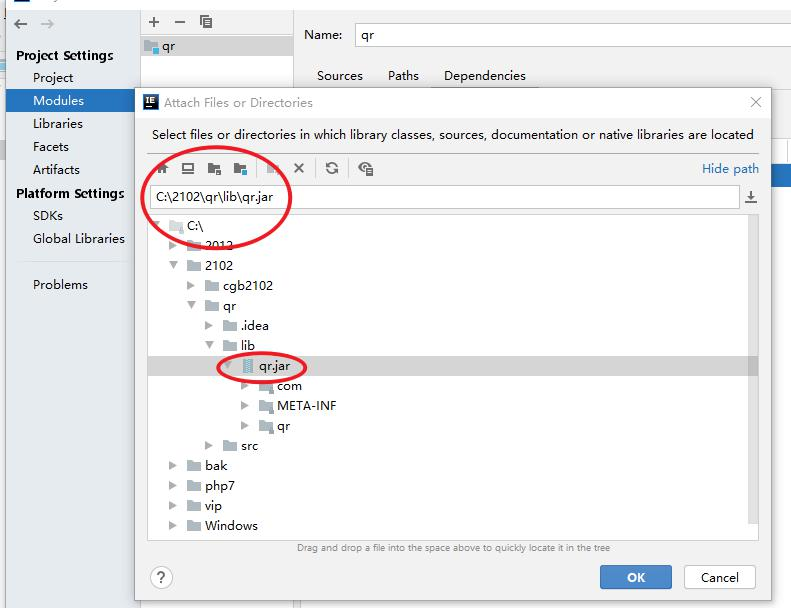

### 前端：
1）开发人员划分：  
	a.前端工程师：作页面，网站  
	***b.后端工程师：数据存储，获取  
	c.测试工程师：单元测试、@Test、集成、压力(高并发)  
	d.运维工程师：保证机器和网络运行  
	e.售前售后工程师：卖产品，后期服务  

鄙视链：  
	CTO技术总监  
	架构师  
	高级程序员、系统分析师  
	中级程序员  
	初级程序员  
	菜鸟  
	
### 前端如何去学习？
做到，基础英文死背硬记：center居中  
html 标签：10几个，20几个  
css样式：20几个  
javascript api(document.getElementById("username"))，  
jQuery（$("#username")）  
*Vue 数据驱动  

## 今天任务：
1、HTML  
2、CSS  
3、永和小票  

## 1、HTML（hyper text mark lanuage）超文本标记语言
	超文本，图片，声音
	标记：<h2>目录</h2> header标题，预定义修饰
	利用HTML就可以实现原始的页面
	标签：闭合<xxx>内容</xxx>
	<head>头信息，title，编码utf-8，安全信息token
	
	<link>小图标，加入外部样式表css
	<script> javascript
	
	<body>页面展现内容
	
	HTML是纯文本

```
<!DOCTYPE html>
<html>
	<header>
		<title>我的网页</title>
	</header>
	<body>
		<h1>我的</h1>
		<h2>目录</h2>
		内容
	</body>
</html>
```

### HTML编辑工具
HTML纯文本，任何的文本编辑器都可以来实现，  
专业工具：  
eclipse/idea，主要java类  
hbuilderx/vs-code  

使用hbuilderx的步骤：  
1）工程（目录），必须先创建一个目录（不要有中文，空格）  
2）打开目录  
3）创建html文件  

### hbuilderx浏览html页面有两种方式：
1）创建html，使用浏览器浏览（手动刷新）  
2）独有，启动一个web服务（自动刷新）推荐  
启动nodejs服务（web服务），自动端口8848  


### 如果html文件乱码
1）设置展现字符集：```<meta charset="utf-8">```  
2）文件本身编码，默认asci，改成utf-8（另存）  

## 2、CSS  级联样式表
Cascading Style Sheets 配合HTML技术实现网页美化    
1）字体大小  

```
<html>
	<head>
		<meta charset="utf-8">
		<title>我的网页</title>
	</head>
	<body>
		<h1>我的第一个网页 </h1>
		<font size="30" color="red">helloworld</font>
		
		<div style="font-size:100px;color:red;">hello world</div>
	</body>
</html>
```

### hbuilderx设置主题
1）工具、主题，选择自己喜欢的配色  
2）文件字体大小，通过ctrl加滚轮调整大小  

### ftp和http协议区别：
目的不同：  
ftp 文件传输协议，远程两台计算机如何传输文件  
http 超文本传输协议，网页，从别人服务器抓取内容（html）来展现  
https 加密base64，网页加载慢  
https://www.jd.com/，DDOS攻击  

### css表现颜色两种方式
1）颜色字符编码 red    
2）rgb颜色数值：3个16进制值组成，计算机0/1,8进制，16进制   
#0A0B0C  
10-A,11-B,12-C,13-D,14-E,15-F  

## 3、永和豆浆订单小票  


### 页面布局方式
1）早期习惯使用table表格布局
<table>表格  
<th>表格头的行  
<tr>表格内容的行  
<td>单元格  
特点：不需写排版代码，它会自适应  
缺点：门户网站  
早期都是table布局，当所有标签，必须解析完，才在页面展现  
页面闪现一下，  
DOM树  

2）现今习惯使用div块布局
把大页面拆成很多小块，每个小块使用div括起来  
div+css  
特点：加载展现快速，没有页面闪现  

### 二维码
里面有很多信息，把文字信息隐藏在这些小块中，
通过它位置定位就能判断图片正确比例，从而确定一个点多大，
把这些块组成文字获取，api
http://act.codeboy.com/
手机扫描二维码，获取到上面文字，手机浏览器会自动打开这个网页

谷歌api就实现二维码图片生成，根据开发者给的文字（链接）会生成它的图片
谷歌api使用非常繁琐，它的方法和参数
封装后，4个参数：宽、高、链接、图片位置 d:/qr.png

开发步骤：
1）创建java工程
2）创建lib目录，把qr.jar拷贝进去
3）导入jar



4）创建类，main，CreateQR.make()4个参数
5）把这个qr.png拷贝到order.html目录中，就可以访问了

### 图片两种链接方式
1）绝对路径 (直接访问网上图片)
http://act.codeboy.com/
images/logo.png
2）相对路径
image/qr.png

## 小结
### 做网站必备两项技术
1）HTML 超文本标记语言，利用规定标签，浏览器会解析这些标签，最终展现在页面
2）CSS 样式表，美化页面
完成静态页面

今日的作业：
1）死背HTML标签
2）死背css样式
3）扩展：电影票（合并单元格、圆角）

明天讲课内容：
