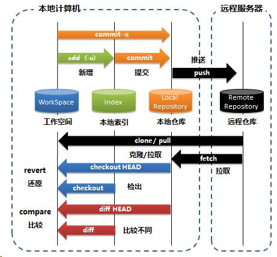

## 知识回顾
培优培养后端工程师（处理数据，业务逻辑加工）
后端工程师是走向架构师捷径

企业要求：面试造火箭，入职拧螺丝
要求后端工程师也要会前端知识：
jsp+servlet，主流vue

网站：HTML+CSS

```

<!DOCTYPE html> 标识这个文件是一个html文件
<html>开头和</html>结尾
两部分<head>标签（头信息）和<body>标签（内容信息）
html网页松散要求，它尽量不报错，如果你没有按语法写，
照样运行（观察结果是否是你想要的）

<meta charset="utf-8">
数据（业务、用户），元数据（描述开发自身信息）
最早网页编码：iso-8859-1（英文）ascii
中cn国专门有一个网页编码：gb2312 国标，gbk台tw湾（繁体）大五码
新标准：unicode 全球所有语言都在其中
主流：在unicode编码基础上，压缩utf-8

解决乱码问题：
1）创建的文件必须是utf-8的格式
2）页面还要设置格式：meta标签charset=utf-8

title标签：网页在浏览器上展示的标题

CSS几种方式：
1）私有		<div style="font-size: 10px;">123</div>
2）本页面公用	一般放在header标签中，
3）多个页面公有	link标签

样式使用有3中方式：
1）作用于标签 body，div
2）class属性，它的名称在style定义，请前面要加.me
3）id属性,#me

如果标签又有id又有class，谁生效？
1）id生效
2）class生效
3）id+class都生效

样式id的优先级高于class，如果相同样式，class不生效
样式是可以叠加

块：html提供两个标签
1）div 会自动换行
2）span 不换行

页面布局：
1）div+css
2）table+自身属性width/height/align/valign

html页面换行和空格
1）<br>、<br/>，页面自己换行，经过浏览器解析变成空格
2）&nbsp; 页面中空多个空格，当做一个

画线：
1）直线，支持：<hr/>
2）斜线
3）竖线
画图片，有斜线，有竖线，作为背景

表格：
特点：根据内容自动调整（自适应）

1）table 表格
2）tr 行
3）th 行头单元格（h5有修饰），字体加粗
4）td 内容单元格
配合自身属性去修饰
border属性，表格边线
width宽度，
align 横向排列：左left（默认）、中center/middle、右right
valign 纵向排列：上top、中center/midlle（默认）、下bottom

图片：
img标签
src	图片地址
	两种方式：
	1）绝对路径（d:/qr.pgn、网上）
	2）相对路径（项目中含有 image/qr.png ）	

width	宽
height	高
只设置一个值，另外一个值会自动等比缩放

相对路径计算：
../向上一层，它下面的image/qr.png
../../向上返两次层，开始算


```

### 今日任务：
1）码云 git镜像网站，github国外网站，版本管理（代码）
2）h5+css3 新增标签和样式  
3）表单（开发者最重要）  

### 码云 
git 版本控制  
同类产品：cvs、svn  
作用：  
1）代码管理，共享代码，网盘，  
区别：  
git不能完全替代svn，  
svn文件管理（开发过程中文档：开发手册、合同、协议），严格的权限控制  
git代码管理（代码开放，权限不严格）  
svn是集中式管理（所有代码都放在一个地方），git是分布式管理  
svn必须联网，git可以暂时不联网  

### git日常怎么工作（工作原理）
github网站（全球开源代码都放在上面）国外网站  
gitee 是github镜像网站（每10分钟同步一次）国内网站，速度高  



### 日常命令，每天都用哪些命令
add 把改变记录下来，放在本地索引中  
	变化：目录新增、文件新增、目录名修改、文件名修改  
	文件内容修改、删除目录、删除文件  
commit 把工作空间相对应文件和操作记录，变化实现到本地仓库  
	文件有两个备份（额外的占用存储空间）  
push 把本地仓库变化同步到远程仓库  
	文件有三个备份（额外的占用存储空间）  
为什么这么麻烦，它形成多个备份，好处当文件不小心丢失，弄坏。  
都可以从远程下载文件  

文件放到远程仓库，大家都可以访问远程仓库，所以团队文件管理（代码）  

刚上班第一天，公司会给你电脑和gitee账号。  
在本机把公司项目部署运行起来，学习！  

1）第一次：clone克隆  
	要把本地目录作为工作空间（不要有中文、不要有空格）  
	git clone https://gitee.com/nutony/res.git  
	执行这个命令，就把本地工作空间res，和远程仓库res链接（关联）  
2）每天每时：pull拉取  
	git pull 上面关联后，把新的内容更新到工作空间（代码更新）  
	
### git环境
1）安装git客户端（一路next），就可以执行git命令，在dos黑窗口下
2）指定工作空间目录（不要有中文目录，不要有空格）
	c:/2102/web2102目录
3）创建远程仓库（gitee码云，必须有账号）
	命名：web2102
	
	
	
	仓库默认是私有的，其他人无法看的。不能共享。修改成公有，大家就可以访问。

### 初始化git目录
mkdir web2102  mkdir dos命令make dir创建目录
cd web2102	cd进入后面目录中

git init					初始化，git监控目录
touch README.md	创建文件（不需要）

git add README.md		新增文件
git commit -m "first commit"	提交，写明原因
git remote add origin https://gitee.com/nutony/web2102.git 和远程仓库挂接
git push -u origin master 提交所有内容

过程中如果提示你输入用户名username和密码password，输入你自己的账号即可

### 圆角头像
1）需要图片（尽量方形）
2）加样式修饰(圆角)

克隆是把整个仓库放到本地，单个文件直接下载
git clone https://gitee.com/nutony/res.git

### 网页的菜单
ul和li标签组成
css修饰

```
<!DOCTYPE html>
<html>
	<head>
		<meta charset="utf-8">
		<title>菜单</title>
		<style>
			ul{
				list-style: none; /* ul所有内容前面修饰点去掉 */
			}
			li{
				float: left; /* float浮动，left，元素紧跟着不换行 */
				margin-right: 10px; /* 外部空白，margin四周空白 */
				background-color: #11ee66; /* 设置背景色 */
				padding: 5px 10px 5px 10px;  /* 内部空白，上右下左，四周空白 */
				border-radius: 5px; /* 圆角 */
			}
			li:hover{ /* 鼠标操作事件:拖动/移动/单击/双击,鼠标移入,移出后自动还原 */
				background-color: #ee1166; /* 设置背景色 */
			}
			a{
				text-decoration: none; /* 去掉a标签下划线修饰 */
				color: white; /* 字体颜色白色 */
			}
		</style>
	</head>
	<body>
		<!-- ul标签分组，li条目 -->
		<ul>
			<!-- a链接，href属性网站地址，target属性设置是否弹出 -->
			<li><a href="https://www.w3school.com.cn/" target="_blank">W3school</a></li>
			<li><a href="https://www.runoob.com/" target="_blank">菜鸟教程</a></li>
			<li><a href="https://www.cnblogs.com/" target="_blank">博客园</a></li>
			<li><a href="https://www.csdn.net/" target="_blank">CSDN</a></li>
			<li><a href="https://segmentfault.com/" target="_blank">思否</a></li>
		</ul>
		
	</body>
</html>

```

### 表单form
表单的组件（标签）和页面普通标签不一样地方：  
表单标签的内容可以传递到后台程序(ajax,java,ssm，微服务。。。)    
形成前端和后端沟通渠道    

文本输入框（姓名），单选框（男女），多选（爱好），文本域（多行）。。。  

### 学生登记系统  
1）创建student.html  
2）写form标签，要提交内容必须放在form标签中  
3）写这些组件（标签）  
4）按钮提交  

如果form的action属性没有写，提交自身页面  
会把页面所有表单中组件信息都拼接在url后面  
第一个参数使用?，第一个之后的参数&符合  

http://127.0.0.1:8848/cgb2102/day02/student.html  

?name=  
&age=  
&edu=1  
&btnSave=%E4%BF%9D%E5%AD%98  

?name=  
&age=  
&sex=%E7%94%B7  
&hobby=%E4%B9%92%E4%B9%93%E7%90%83  
&hobby=%E7%88%AC%E5%B1%B1  
&edu=1  
&btnSave=%E4%BF%9D%E5%AD%98  

?name=%E7%8E%8B%E6%88%90  
&age=20  
&sex=%E7%94%B7  
&hobby=%E4%B9%92%E4%B9%93%E7%90%83  
&hobby=%E7%88%AC%E5%B1%B1  
&hobby=%E5%94%B1%E6%AD%8C  
&edu=%E6%9C%AC%E7%A7%91  
&btnSave=%E4%BF%9D%E5%AD%98  

### get请求和post请求的差异
get提交，会在url后面拼接参数，500字符  
post提交，不会展现，直接传递后台，4k~8k，安全看不见，传输数据量比较大  
提倡post  

### 小结：
1）git使用  
工作空间、本地索引、本地仓库（不能共享，自己用）、远程仓库（共享）  
版本控制工具：1.0,2.0,3.0  
2）git常用命令  
git add . 	把内容建立索引  
git commit -m "原因"	 把工作空间中文件+索引，去内容保存到本地仓库  
git push  把本地仓库推送到远程仓库  
不是每次都执行这3条  

3）h5+css3  
提高版本，主流版本，增强页面表现力  

4）表单form  

<!DOCTYPE html>
<html>
	<head>
		<meta charset="utf-8">
		<title>学生信息管理系统</title>
	</head>
	<body>
		<!-- 表单组件，action提交的链接地址（后端java，Controller）
			 method="get/post"，默认get请求
		 -->
		<form action="studentController" method="post">
			<h1>学生信息管理系统</h1>
			
			<div>
				<label>姓名：</label>
				<!-- 文本输入框，起名和其他组件区别，name+id都设置 -->
				<input type="text"  name="name" id="name" />
			</div>
			
			<div>
				<label>年龄：</label>
				<!-- 数字输入框，只能输入数字 -->
				<input type="number" name="age" id="age"/>
			</div>
			
			<div>
				<label>性别：</label>
				<!-- 单选框, 必须名称一致，自动会变成一组 -->
				<input type="radio" name="sex" id="sex" value="男"/>男
				<input type="radio" name="sex" id="sex" value="女"/>女
			</div>
			
			<div>
				<label>爱好：</label>
				<!-- 多选框，多个名字相同，自动变成一个组，后台接收是一个数组
					打勾就传递后台，不打勾不传递
				 -->
				<input type="checkbox" name="hobby" id="hobby" value="乒乓球"/> 乒乓球
				<input type="checkbox" name="hobby" id="hobby" value="爬山"/> 爬山
				<input type="checkbox" name="hobby" id="hobby" value="唱歌"/> 唱歌
			</div>
			
			<div>
				<label>学历：</label>
				<!-- 下拉框（单个值），选中中文，本质数字
					1-小学，2-初中，3-高中，4-大专，5-本科
				-->
				<select name="edu" id="edu">
					<option value="1">小学</option>
					<option value="2">初中</option>
					<option value="3">高中</option>
					<option value="4">大专</option>
					<option value="5">本科</option>
				</select>
			</div>
			
			<div>
				<!-- 按钮有两种形式，普通按钮button，
					提交submit，自动提到form.action指定url链接 studentController
				-->
				<input type="submit" name="btnSave" value="保存"/>
				<button type="button" name="btnClear">取消</button>
			</div>
		</form>
	</body>
</html>
