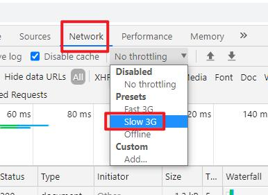

## 知识回顾
javasript升级jQuery  
jQuery原生js好用，把js简化，增强它功能，  
让开发者开发效率变高，用符号简化，学习成本高  
最强大地方：选择器以各种方式来快速定位页面某个元素，  
方便操作这个元素（获取值，写入值，样式修饰）  
选择器：$(".name")、$("#name")、  
$"[:text]" 找到页面上所有的text框，数组  
执行动作：action()，函数  
username.value = "wang";  
username.val("wang");  

margin去掉  
username.css("margin", "0px");  
username.css("margin", 0);  

element.val();	//text,number,password 文本框value  
element.text();		//div,span 块 innerText 纯文本  
element.html();	//div,span 快 innerHTML 支持HTML编码  

element.css(k,v);	//样式选择器，k样式api，v对应新值  
element.prop(k,v);	//disabled,true 按钮属性  property  
element.attr(k,v);		//属性如果是非true/false，就是要attr  

javascript衍生品，子集JSON  
比txt，它层级，有结构（树），检索快  
比xml，标记语言和html类似，xml数据交换，他有层级，有结构  
	它喧宾夺主，标签所占用的空间远超数据量，大型分布式结构，网络  
json淘汰，没有那么多的标签，k（name/age),v结构  
利用特殊分隔符：把xml的标签都去掉  
[	数组  
}	一条记录（一个对象）  
: kv之间分隔符  
, 多个属性之间分隔符  
```
[
	{
		"p":"17999.00",
		"op":"17999.00",
		"cbf":"0",
		"id":"J_100010378153",
		"m":"100000.00"
	}
]
```
### js的前期绑定和后期绑定
1）前期绑定，写标签时就设定它事件，onclick="doSubmit()"，读程时直观  
2）后期绑定，采用匿名函数（私有，安全），隐晦，往往把这些方法放入js文件，灵活  
两个都用，根据业务，  

### JSON工具类
常用就2个方法  
1）JSON.parse(jsonstr);		把json字符串转换js对象  
2）JSON.stringify(js)；		js对象，转换jsonstr，java.jackson JSON  

javascript衍生品，子集AJAX  

通过上面这个技术，网页可以发起请求  
xml技术相关、http基于http协议、request请求、response响应  

### 访问网站后台两种方式：
1）表单提交， form（get/post）action指的链接就是你要请求网页地址，  
	提交完成，页面地址会发生变化  
2）ajax，不变化页面，局部刷新（京东价格ajax二次提交）而不用切换页面  
SPA single page application 单页面应用 vue  

ajax原生对象XmlHttpRequest，这个api冗长，还需要额外学习api  
使用jQuery封装后的ajax，代码结构简单一些  

ajax封装请求后，会把返回json字符串（京东），它会把字符串转换js对象，  
我们得到结果就是js对象  

$.ajax();  
参数：  
1）type 请求方式，get/post  
	url: "https://p.3.cn/prices/mgets"
	data: {
		skuIds: "J_100010378153"
	}
						http://localhost:8080/studenetController
2）url 请求地址，https://p.3.cn/prices/mgets?skuIds=J_100010378153  
3）dataType 指定返回数据类型，json，跨域（错误），jsonp  
CORS policy: No 'Access-Control-Allow-Origin'  
	原因：js特点，弱语言，它是为浏览器而生（安全，不允许本地文件，
		不允许调用其他网站资源，安全策略：不允许跨域 域名baidu.com,tedu.cn）
		CORS policy： No ＇Access-Control-Allow-Origin＇
		 不能跨越访问其他网站，1）不能不同域名 localhost,baidu.com
			2）baidu.com:80，baidu.com:8080，不能端口号不同
			
		localhost，p.3.cn（域名不同，算跨域，不允许）
	解决：
	dataType:"jsonp"
	
	实际开发中就发生跨域的问题，我的localhost需要京东的网站p.3.cn
	推出新的技术，jsonp，fun(json)
	jQuery支持jsonp方式，它会自动命名fun名字
	json值是京东请求后的结果，套上函数，jquery请求，&jQuery123传递京东网站
	京东网站查询某个商品数据，返回json
	京东网站里有传入名字，封装：jQuery123(json); 把这个结果返回
jQuery110206847092573562594_1617344264559
(
	[{"p":"17999.00","op":"17999.00","cbf":"0",
	"id":"J_100010378153","m":"100000.00"}]
);
京东网站封装结果本质字符串，截串，
按(开始，)结束，substring截取字符串，中间结果json
var arrays = JSON.parse(json);
	

4）响应，函数中，success: function(data){  解析data } 匿名函数，ajax它会把返回结果放在data对象中  

里面参数是一个js对象  
```
$.ajax({  
	type: "get",  
	url: "https://p.3.cn/prices/mgets?skuIds=J_100010378153",  
	dataType: "jsonp",  
	success: function(data){  
		//解析 data是一个json字符串已经被转换js对象  
		[{"p":"1799.00","op":"17999.00","cbf":"0","id":"J_100010378153","m":"100000.00"}]  
		
		data[0].p
		data[0].id
	}
});
```
不是每个链接都有http和https请求执行，后台要支持  
把https协议换成http  

### js升级演变
三个阶段演化    
1）javascript，版本es6，es7,（脚本语言）api  
2）jQuery（本质封装js，简化） api  val()，text()  
3）angularJS/reactJS/VueJS  js框架（灵魂：）数据驱动、组件化，MVVM框架  

Vue渐进式框架，按需来引入内容，开发SPA单页面方式js框架。  
1）核心（数据驱动）vue.js(几十kbjs文件)  
2）核心+组件（vue客户端,200m）  
3）核心+组件+路由router  
4）核心+组件+路由+状态  
5）核心+组件+路由+状态+工具：npm/webpack  

### Vue案例
1）vue.js第三方开发，导入 vue.js（res/js/vue.js)下载  
2）在页面中导入vue.js文件  
3）传统页面js/jQuery的代码和html代码交织，vue独立分开  
	在body中单独加一个div id="app"，将来vue进行渲染区域，div外面就不受控  
4）创建vue对象  
	var vm = new Vue();  
5) 参数js对象，它有特殊写法  
	{  
		el: "#app",	挂载点  
		data: 数据js对象  
	}  
6）插值表达式：{{msg}},vue会去data找msg定义，获取它的值，把它显示到div（渲染）  

### vue的特点
1）没有完全专门api，无需额外太多记忆 document,getElementById, val()  
2）js、jQuery它们的代码和html代码,css代码交织！  
	分层概念，后端，TCP/IP7层，ModelViewController框架 3层，各司其职，清晰  
	MVVM Vue框架，各司其职：  
	Model，数据 user(name,age)  
	View，视图，展现，html，把数据进行渲染 div id=app，{{name}}  
	ViewModel，Vue把M和V联系起来（翻译）  

### js/jQuery/Vue不同
v-model 双向绑定  
v- Vue提供一套特殊指令（命令）vue会自动翻译  

js/jQuery都是单向，只能通过api操作，api操作页面变化  
vue双向，通过 操作数据，页面变化；页面变化，数据也变化  
编程方式的不同  

文本框内容v-model后，它改变，页面所有引用，跟着改变  
js document.getElementById("address").value = 南京十三陵  

三种方式，vue是没有api，直接访问js对象和对象属性  
vue是自动刷新，更新页面内容！！！  

称为框架，它很多自动化，减少api学习，直接操作数据，其他引用随着变化！  

Vue渲染查找表达式值时，会有bug，会有短暂停留，然后才转换  
页面div标签，构造DOM已经完成，这部分内容还未被vue渲染，但已经展现（浏览器）  

Vue提供新指令 v-cloak 去除闪现  
等vue渲染完(display:block)，才让这个div展现，先把div不展现（display:none)  
1）在div增加属性 v-cloak  
2）在页面加一个样式，[v-cloak]{} 选择器样式  

准备数据：  
vue如何表达对象：  
单值、多值、数组（爱好颜色）、对象  


v-if 判断，false，在页面上就不展现  
v-show 判断，在页面上展现，样式来屏蔽（如果值频繁切换，性能高）  

v-for 循环  

url在页面写一个连接  
http://act.codeboy.com  

## 小结
### 1）ajax请求  
扩展js，请求别的链接，别的系统，获取值，返回  
返回：纯文本txt，json（本网站后台使用），  
jsonp格式（跨域，访问别人网站后台使用）  

### json和jsonp区别  
jsonp：fun(json)   
写法语法规定，本质都是json  

软件系统前台系统和后台系统对接  
前台页面发起ajax请求，访问后台系统，  
后台系统数据加工处理，返回json  
前台通过success方法参数接收到json字符串，  
内部转换成js对象，利用js/jQuery/vue来解析js对象  
从中获取属性，展现在页面  

主流开发方式：实现SPA单页面开发  

### 2）Vue
Vue称为第三代js技术  
a. javascript api工具包  
b. jQuery api工具包  
c. AngulyJS、ReactJS、VueJS 三足鼎立，框架  

数据驱动，组件化，路由，状态  

### 3）结构MVVM框架（自动化实现了很多功能，无需开发者去实现）  
a. 导入vue.js 核心  
b. View 视图，div id="app" ，渲染这个区域  
c. Model 数据，data: { 数据 }  
d. ViewModel ，作用中间转换，怎么把数据呈现  
	Vue自动化  

### 4）通过指令集  
JSP(JSTL jsp标签库)+Servlet  
JSP+JSTL被vue替代  
Servlet被封装，springmvc  

v- 指令，用在html标签属性上  
v-clock，解决插值表达式闪现问题  
v-model，双向绑定  
	改变页面值，数据随之改变  
	改变数据，页面插值表达式随之改变  
	js和jQuery最大区别，单向  
v-for，for循环  

v-show 判断，在页面上，但没展现  
	display:none遮蔽  
v-if 判断，值不在页面上  

v-if		实现多个分支判断  
v-else-if  
v-else  

v-bind 绑定，简写:href  
	在属性中使用 data中数据  

v-on:click 事件，简写@click  


安装好NodeJS，8.11，15.11  

	